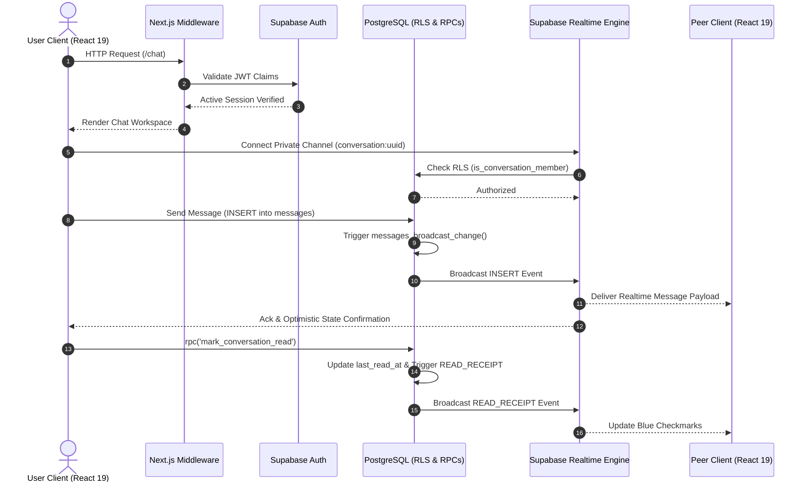
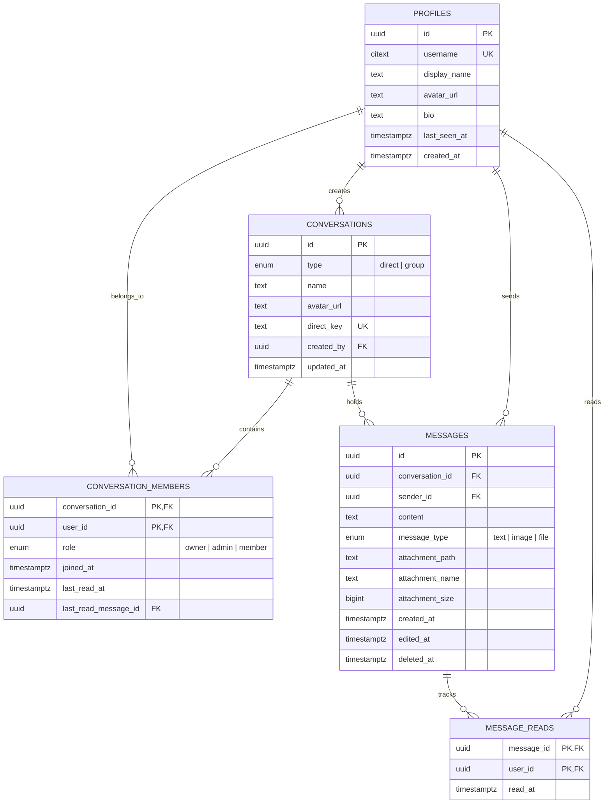

# Aether Chat — Production Realtime Communication Engine

Aether Chat is a full-stack, high-performance real-time messaging web application built with **Next.js 16 (App Router)**, **React 19**, **TypeScript**, **Tailwind CSS**, and **Supabase (PostgreSQL, Auth, Realtime Engine, Storage)**.

Rather than relying on unverified third-party libraries, Aether Chat is engineered directly on top of PostgreSQL Row Level Security (RLS), Supabase WebSockets (Broadcast & Presence), and server-side RPC functions to enforce strict multi-tenant isolation and low-latency state synchronization.

---

## 🏗️ System Architecture

The following Mermaid diagram outlines the end-to-end data flow between Next.js App Router client components, SSR Middleware, Supabase Authentication, PostgreSQL Database, and the Supabase Realtime Engine.



---

## 🗄️ Database Schema & ER Diagram

The database uses PostgreSQL with `citext` for case-insensitive unique handles and strict foreign key constraints across user profiles, conversations, memberships, messages, and read receipts.



---

## 📊 Feature Status Matrix

| Category | Feature | Status | Technical Implementation |
| :--- | :--- | :--- | :--- |
| **Authentication** | Email & Password Auth | ✅ Implemented | Supabase Auth with server-side cookie session validation in `middleware.ts` |
| **Authentication** | Automatic Profile Creation | ✅ Implemented | PostgreSQL trigger `on_auth_user_created` creates profile on signup |
| **Messaging** | Direct One-on-One Chat | ✅ Implemented | Unique pair key `least(u1, u2):greatest(u1, u2)` prevents duplicate direct threads |
| **Messaging** | Group Conversations | ✅ Implemented | `create_group_conversation` RPC with membership roles (`owner`, `admin`, `member`) |
| **Realtime** | Instant Message Delivery | ✅ Implemented | Supabase Private Realtime Channels (`conversation:<id>`) & Database Broadcast Triggers |
| **Realtime** | Online Presence Tracking | ✅ Implemented | Global presence topic with 30s heartbeat & tab visibility re-tracking |
| **Realtime** | Typing Indicators | ✅ Implemented | Ephemeral WebSockets broadcast events with 1.4s auto-reset timers |
| **Realtime** | Read Receipts & Unread Count | ✅ Implemented | `mark_conversation_read` RPC updating `message_reads` and `last_read_at` |
| **Storage** | File & Image Attachments | ✅ Implemented | Private Supabase Storage bucket (`chat-files`) with 6MB limit & RLS folder checks |
| **UI / UX** | In-Chat Message Filtering | ✅ Implemented | Instant client-side message & attachment search filter |
| **UI / UX** | Dark & Light Theme | ✅ Implemented | `next-themes` with custom cyan-blue aesthetic and Tailwind CSS 4 |
| **Notifications** | Web Audio Sound & Push Toast | 🟡 In Progress | Web Audio API sine-wave chime & browser Notification API push alerts |
| **Calling** | Voice / Video P2P Calls | 🔮 Planned | WebRTC signaling channel integration with P2P mesh network |
| **Bot AI** | Aether AI Assistant | 🔮 Planned | OpenAI / Gemini API streaming chat integration |

---

## 🔒 Security Architecture & RLS Policies

Aether Chat enforces data security directly inside PostgreSQL to guarantee users cannot inspect or modify conversations they do not belong to:

1. **Strict Row Level Security (RLS)**:
   - Tables (`profiles`, `conversations`, `conversation_members`, `messages`, `message_reads`) have RLS enabled.
   - SQL function `public.is_conversation_member(p_conversation_id, p_user_id)` validates membership in constant-time subqueries.
2. **Security Definer RPCs**:
   - `create_direct_conversation(other_user)`: Evaluates user authentication and creates or retrieves existing direct chat idempotently.
   - Direct `INSERT` on `conversations` is restricted, forcing clients through security-validated RPCs.
3. **Immutable Identity Trigger**:
   - PostgreSQL trigger `messages_protect_identity` blocks updates to `id`, `conversation_id`, `sender_id`, and `created_at` on existing messages.
4. **Storage Bucket Protection**:
   - Private bucket `chat-files` permits `SELECT` and `INSERT` only if the authenticated user passes `is_conversation_member` for the file's conversation directory.

---

## 🛠️ Deep-Dive: 4 Real Engineering Challenges Solved

### Challenge 1: Dual-Key Online Presence Synchronization & Race Condition Prevention
* **Problem**: In multi-device or multi-tab usage, user presence states frequently got stuck in an "online" state due to ghost connections or delayed disconnect events when closing tabs.
* **Solution**: Implemented a global presence topic (`online-users`) paired with per-conversation heartbeat checks. Presence payload uses dual-key indexing `(user_id, session_id)` with a 30-second heartbeat ping and HTML5 `visibilitychange` listeners. When a tab returns to the foreground, it re-asserts presence instantly.

### Challenge 2: Optimistic UI Updates & Message Delivery Ordering
* **Problem**: Optimistic message inserts could cause message jumping or duplicate keys when real-time WebSocket payloads arrived back from the server.
* **Solution**: Messages are assigned deterministic client UUIDs. The UI appends the optimistic message state immediately, while the server RPC handles canonical timestamping. Upon receiving the database trigger `INSERT` broadcast, the client deduplicates messages by ID and updates read statuses atomically.

### Challenge 3: Tenant Data Isolation via Row Level Security (RLS)
* **Problem**: Client-side query filters (e.g. `.eq("conversation_id", id)`) can be bypassed by malicious actors calling the API directly.
* **Solution**: All queries are evaluated against PostgreSQL RLS policy `public.is_conversation_member(conversation_id, auth.uid())`. Even if a client attempts to fetch messages from an arbitrary UUID, PostgreSQL returns an empty set at the database layer.

### Challenge 4: Low-Latency Realtime Synchronization Across Active Tabs Without Memory Leaks
* **Problem**: Subscribing to multiple conversation channels simultaneously led to memory leaks and channel allocation limits in Supabase.
* **Solution**: Combined conversation-specific channels for active view threads with a single background user-level channel (`user-conversations:<user_id>`). When background conversations receive new messages, the server broadcasts lightweight notification triggers to the user's channel without subscribing to full message payloads until the user selects the conversation.

---

## 🧪 Testing & Quality Assurance

Aether Chat includes unit and integration test coverage powered by **Vitest** and **React Testing Library**.

### Running Tests

```bash
# Run unit & component tests
npm test

# Run TypeScript type verification
npm run typecheck
```

### Test Coverage Focus
- `__tests__/utils.test.ts`: Tests conversation peer resolution, display title logic, initials generation, file size formatting, and path sanitization.
- `__tests__/validation.test.ts`: Tests attachment file size limits (6MB max), MIME type checks, forbidden executable extensions (`.exe`, `.sh`), and 2000-character message length limits.
- `__tests__/rls-policy.test.ts`: Tests direct key generation (`least(u1, u2):greatest(u1, u2)`) and authorization member checks.

---

## 🚀 Setup & Local Development Guide

### Prerequisites
- **Node.js**: v20.0.0 or higher
- **npm**: v10.0.0 or higher
- **Supabase Account**: A active Supabase project

### 1. Clone & Install Dependencies

```bash
git clone https://github.com/your-username/aether-chat.git
cd aether-chat
npm install
```

### 2. Configure Environment Variables

Create `.env.local` based on `.env.example`:

```bash
cp .env.example .env.local
```

Fill in your Supabase project credentials:

```env
NEXT_PUBLIC_SUPABASE_URL=https://your-project-ref.supabase.co
NEXT_PUBLIC_SUPABASE_ANON_KEY=your-supabase-anon-key
NEXT_PUBLIC_SITE_URL=http://localhost:3000
```

### 3. Initialize Database Schema & RLS Policies

Copy the contents of [`supabase/migrations/001_chatsphere.sql`](supabase/migrations/001_chatsphere.sql) and execute it inside the **Supabase SQL Editor** (or deploy via Supabase CLI `supabase db push`).

### 4. Run Development Server

```bash
npm run dev
```

Open [http://localhost:3000](http://localhost:3000) in your browser.

---

## ⚠️ Known Limitations

1. **Attachment Size Ceiling**: File uploads are capped at 6MB per file to maintain optimal performance on free-tier storage buckets.
2. **Supabase Realtime Free Tier Limits**: Free-tier Supabase projects support up to 200 concurrent WebSocket connections.
3. **P2P Audio/Video**: Voice and video call buttons trigger a clear "Coming Soon" notification dialog until WebRTC signaling servers are provisioned.

---

## 📜 License

This project is open-source and available under the [MIT License](LICENSE).
