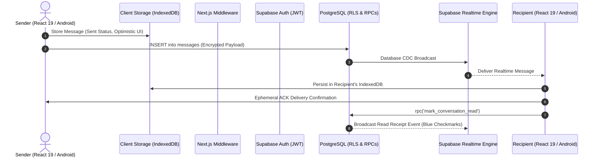
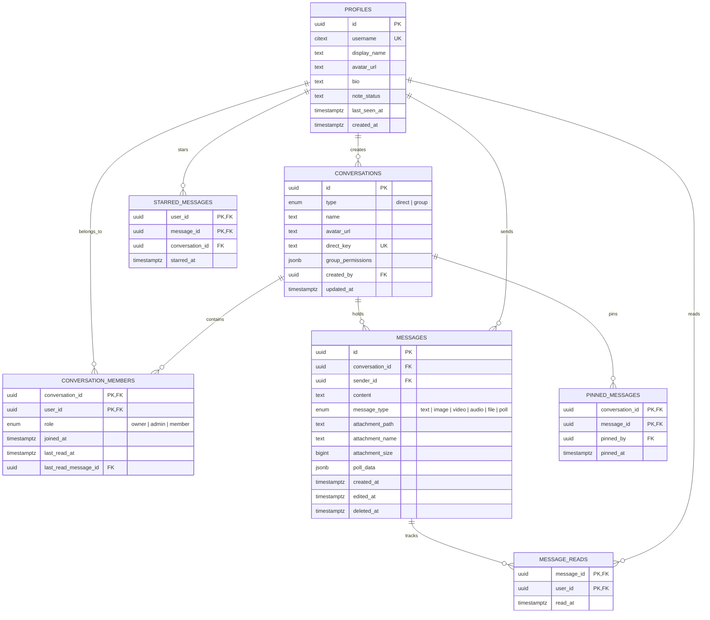

# ⚡ Aether Chat — Enterprise Realtime Communication Engine

<div align="center">


[](https://nextjs.org/)
[](https://react.dev/)
[](https://tailwindcss.com/)
[](https://supabase.com/)
[](https://capacitorjs.com/)
[](https://developer.android.com/)
[](https://vitest.dev/)
[](LICENSE)

<br/>

**Aether Chat** is a WhatsApp-grade, full-stack real-time communication platform engineered with Next.js 16 (App Router), React 19, TypeScript, Tailwind CSS, Supabase PostgreSQL with strict Row Level Security (RLS), and Capacitor 7 for cross-platform Android mobile deployment.

[📱 Download Android APK](#-download-mobile-app) • [✨ Key Features](#-key-feature-breakdown) • [🏗️ Architecture](#%EF%B8%8F-system-architecture) • [🚀 Quick Start](#-local-development-setup) • [🤖 Android Build](#-android-apk-build-guide)

</div>

---

## 📱 Download Mobile App

Install the native Android release build directly onto your device. Enjoy full hardware back-button navigation, floating glassmorphic navigation rails, smooth long-press interactions, and zero-latency local caching.

<div align="center">

[](https://github.com/akashdebbarma06/Real-Time-Chat-Application/releases/latest/download/app-debug.apk)
[](https://github.com/akashdebbarma06/Real-Time-Chat-Application/raw/main/public/downloads/AetherChat.apk)

**Latest Build Version:** `v1.0.0` • **Package ID:** `com.aetherchat.app` • **Min SDK:** `Android 5.1 (API 22)` • **Target SDK:** `Android 14 (API 34)`

</div>

### 📥 Android Installation Instructions

1. **Download APK**: Tap the green button above or grab [`app-debug.apk`](https://github.com/akashdebbarma06/Real-Time-Chat-Application/releases/latest/download/app-debug.apk) directly on your Android phone.
2. **Authorize Unknown Sources**: When prompted by Chrome or your file manager, enable **"Allow from this source"** (*Settings > Apps & notifications > Special app access > Install unknown apps*).
3. **Install & Launch**: Tap **Install** and launch **AetherChat** from your app drawer.
4. **Grant Permissions**: Upon initial launch, Aether Chat features a permissions prompt for Camera, Microphone, and Realtime Notifications.

---

## 🏗️ System Architecture

Aether Chat uses a hybrid **Local-First client storage** model combined with an **ephemeral backend store-and-forward relay**:


```mermaid
sequenceDiagram
    autonumber
    actor User as Sender (React 19 / Android)
    participant ClientDB as Client Storage (IndexedDB)
    participant MW as Next.js Middleware
    participant Auth as Supabase Auth (JWT)
    participant DB as PostgreSQL (RLS & RPCs)
    participant RT as Supabase Realtime Engine
    participant Peer as Recipient (React 19 / Android)

    User->>ClientDB: Store Message (Sent Status, Optimistic UI)
    User->>DB: INSERT into messages (Encrypted Payload)
    DB->>RT: Database CDC Broadcast
    RT-->>Peer: Deliver Realtime Message
    Peer->>ClientDB: Persist in Recipient's IndexedDB
    Peer->>User: Ephemeral ACK Delivery Confirmation
    Peer->>DB: rpc('mark_conversation_read')
    DB-->>RT: Broadcast Read Receipt Event (Blue Checkmarks)
```

### 🗄️ Relational Entity-Relationship Diagram (ERD)


```mermaid
erDiagram
    PROFILES ||--o{ CONVERSATIONS : creates
    PROFILES ||--o{ CONVERSATION_MEMBERS : belongs_to
    CONVERSATIONS ||--o{ CONVERSATION_MEMBERS : contains
    CONVERSATIONS ||--o{ MESSAGES : holds
    PROFILES ||--o{ MESSAGES : sends
    MESSAGES ||--o{ MESSAGE_READS : tracks
    PROFILES ||--o{ MESSAGE_READS : reads
    CONVERSATIONS ||--o{ PINNED_MESSAGES : pins
    PROFILES ||--o{ STARRED_MESSAGES : stars

    PROFILES {
        uuid id PK
        citext username UK
        text display_name
        text avatar_url
        text bio
        text note_status
        timestamptz last_seen_at
        timestamptz created_at
    }

    CONVERSATIONS {
        uuid id PK
        enum type "direct | group"
        text name
        text avatar_url
        text direct_key UK
        jsonb group_permissions
        uuid created_by FK
        timestamptz updated_at
    }

    CONVERSATION_MEMBERS {
        uuid conversation_id PK, FK
        uuid user_id PK, FK
        enum role "owner | admin | member"
        timestamptz joined_at
        timestamptz last_read_at
        uuid last_read_message_id FK
    }

    MESSAGES {
        uuid id PK
        uuid conversation_id FK
        uuid sender_id FK
        text content
        enum message_type "text | image | video | audio | file | poll"
        text attachment_path
        text attachment_name
        bigint attachment_size
        jsonb poll_data
        timestamptz created_at
        timestamptz edited_at
        timestamptz deleted_at
    }

    MESSAGE_READS {
        uuid message_id PK, FK
        uuid user_id PK, FK
        timestamptz read_at
    }

    PINNED_MESSAGES {
        uuid conversation_id PK, FK
        uuid message_id PK, FK
        uuid pinned_by FK
        timestamptz pinned_at
    }

    STARRED_MESSAGES {
        uuid user_id PK, FK
        uuid message_id PK, FK
        uuid conversation_id FK
        timestamptz starred_at
    }
```

---

## ✨ Key Feature Breakdown

### 💬 1. Chat & Real-Time Messaging Engine
- **Direct & Group Conversations**: Deterministic pair keys (`least(u1, u2):greatest(u1, u2)`) eliminate duplicate direct chats. Group conversations support owner, admin, and member role privileges.
- **Message Actions**: Hover/context action sheet with Pin, Star, Reply, Copy, Forward, Edit (15-min window), and Soft Delete ("Delete for everyone").
- **Message Reactions**: Full emoji reaction tray with multi-user breakdown popover (`reaction-details-dialog`).
- **Interactive Polls**: In-bubble poll creator with multiple choices, real-time vote percentage tallies, and member avatars.
- **Voice Notes**: Integrated recorder with real-time waveform visualizer, instant playback, seek scrubbing, and variable audio speed toggling (1x, 1.5x, 2x).
- **Typing Indicators & Live Presence**: Ephemeral WebSockets broadcast events with 1.4-second auto-reset debounce and dual-key `(user_id, session_id)` presence tracking.

### 🎨 2. Media Studio, Camera & Canvas Editor
- **Integrated Camera Capture**: Direct in-app camera viewfinder (`camera-capture-dialog`) with front/back camera switching, live video stream preview, and high-resolution photo snapshots.
- **Photos & Videos Preview & Canvas Studio**:
  - **Freehand Canvas Pen**: Draw with adjustable brush sizes, responsive smoothing, color pickers, and undo stacks.
  - **Text Stickers & Overlays**: Drag, position, rotate, and style moveable caption labels directly on media.
  - **Live Image Filters**: Normal, Grayscale, Sepia, Vibrant, Invert presets.
  - **Video Previews**: Inline HTML5 video playback and thumbnail slicing before transmission.
- **WhatsApp Media Lightbox**: Immersive full-screen media viewer with double-tap zoom, pinch-to-zoom, panning, download actions, and keyboard navigation (`←` / `→` / `Esc`).

### 🗄️ 3. Media Vault
A dedicated 3-tab media repository per conversation with live search and filtering:
1. **Media Tab**: High-speed photo and video grid with direct lightbox launch.
2. **Docs Tab**: Structured document list displaying file extension icons, file sizes, timestamps, and one-tap download.
3. **Links Tab**: Automated regex URL parser extracting HTTP/HTTPS hyperlinks, page titles, and snippet context.

### 📱 4. Multi-Platform Interaction & Gesture Engine
- **Desktop Context Menus**: Right-clicking a conversation tile calls `event.preventDefault()` to navigate immediately and display options without native browser context flashing.
- **Isolated Options Trigger**: Left-clicking the options chevron button uses `event.stopPropagation()` to open the menu exclusively without triggering room navigation.
- **Mobile Long-Press Gestures**: 500ms touch timer with automatic cancellation on `touchmove` (>10px) or `touchcancel` to prevent accidental triggers while scrolling.
- **Hierarchical Hardware Back Navigation**: Android back button and browser history listener dismisses overlays cleanly without ejecting the user:
  1. **Priority 1 (Modals/Overlays)**: Lightboxes, reaction dialogs, bottom sheets.
  2. **Priority 2 (Drawers/Sub-Panels)**: Contact info, Group info, Appearance, and Settings drawers.
  3. **Priority 3 (Active Conversation)**: Returns from chat room to conversation list.
  4. **Priority 4 (Root View)**: Allows native Android back/minimize.

### 🎨 5. Theming, Appearance & Dynamic Design Tokens
- **Theme Modes**: Seamless Dark, Light, and System modes.
- **Curated Accent Palette**: Purple, Blue, Emerald, Rose, Amber, and Cyan themes applied via dynamic CSS variables across all components.
- **Custom Bubble Geometries**: Rounded, Classic WhatsApp, Minimalist, and Pill chat bubbles.
- **Doodle Wallpaper Overlays**: WhatsApp-style vector chat background doodle pattern with adjustable contrast and opacity.
- **Dynamic App Branding**: Live browser favicon and PWA icon switching based on selected accent color.

### 👤 6. WhatsApp-Style Profile Hub
- **Bottom Slide-Up Action Sheet**: Quick avatar customization trigger (`profile-photo-sheet`).
- **3 Avatar Sources**: Direct Camera snapshot, Local Device Gallery upload, and curated vector sticker presets.
- **Profile Metadata**: Live display name, `@username` handle, status notes (24h expiring status), and phone verification status.

### 💾 7. Storage Management & Data Control
- **Live Device Storage Manager API**: Direct queries via `navigator.storage.estimate()` calculating exact local quota usage and device limits.
- **IndexedDB Media Breakdown**: Precise calculation of photos, videos, audio notes, and document footprint cached on the user's phone.
- **One-Tap Cache Purge**: Safely clear cached media without losing message history.

---

## 🛠️ Tech Stack

| Layer | Technologies |
| :--- | :--- |
| **Frontend Framework** | **Next.js 16.2.12** (Turbopack, App Router, React Server Components) |
| **UI Library** | **React 19.0.0**, **TypeScript 5.x**, **Tailwind CSS 4.0** |
| **Icons & Design** | **Lucide React**, Glassmorphic Design System, Tailwind Color Tokens |
| **Backend & Database** | **Supabase** (PostgreSQL 15+, Auth, Realtime WebSockets, Storage) |
| **Mobile Runtime** | **Capacitor 7.0** (`@capacitor/core`, `@capacitor/android`, `@capacitor/app`) |
| **Client Storage** | **IndexedDB** (`idb`), `localStorage`, HTML5 Storage Manager API |
| **Testing** | **Vitest 3.2**, **React Testing Library**, **jsdom** |

---

## 🚀 Local Development Setup

### Prerequisites
- **Node.js**: v20.0.0 or higher
- **npm**: v10.0.0 or higher
- **Supabase Account**: A free Supabase project with Database & Auth enabled

### 1. Clone Repository & Install Dependencies
```bash
git clone https://github.com/akashdebbarma06/Real-Time-Chat-Application.git
cd Real-Time-Chat-Application/aether-chat
npm install
```

### 2. Configure Environment Variables
Create a `.env.local` file in `aether-chat/`:
```bash
cp .env.example .env.local
```

Populate with your Supabase credentials:
```env
NEXT_PUBLIC_SUPABASE_URL=https://your-project-id.supabase.co
NEXT_PUBLIC_SUPABASE_ANON_KEY=your-supabase-anon-key
NEXT_PUBLIC_SITE_URL=http://localhost:3000
```

### 3. Initialize Database Migrations
Run the SQL migration script located in [`supabase/migrations/001_aether_chat.sql`](supabase/migrations/001_aether_chat.sql) inside your Supabase SQL Editor. This provisions:
- Core tables (`profiles`, `conversations`, `messages`, `message_reads`, `pinned_messages`, `starred_messages`, `blocked_users`).
- Row Level Security (RLS) policies and `citext` handle indexes.
- Storage bucket permissions (`chat-files`, `avatars`).
- Real-time notification triggers and RPC functions.

### 4. Start the Dev Server
```bash
npm run dev
```
Open [http://localhost:3000](http://localhost:3000) to view the application in your browser.

---

## 🤖 Android APK Build Guide

Aether Chat uses Capacitor 7 to bundle the web client into an optimized native Android application.

### Prerequisites
- **Android Studio** (Koala or newer) with Android SDK Platform 34 installed.
- **Java Development Kit (JDK)**: JDK 21 (required by Capacitor).

### 1. Sync Web Assets with Android Project
```bash
# Build production bundle and sync with native Capacitor assets
npm run build
npx cap sync android
```

### 2. Build Debug APK via Gradle
```bash
# Navigate to the native android directory
cd android

# On Windows PowerShell:
.\gradlew.bat assembleDebug

# On Linux / macOS:
./gradlew assembleDebug
```

The compiled APK will be generated at:
```
android/app/build/outputs/apk/debug/app-debug.apk
```

### 3. Run Directly on Connected Device / Emulator
```bash
npx cap run android
```

---

## 🧪 Testing & Code Quality Pass

Aether Chat maintains strict quality control with 24 test suites covering business logic, security policies, navigation hierarchies, and gesture interactions.

```bash
# Run the complete test suite
npm test

# Run ESLint validation (0 errors)
npm run lint

# Run Next.js production build verification
npm run build
```

### Test Coverage Highlights
- `__tests__/local-first-storage.test.ts`: Client IndexedDB persistence, ephemeral queue ACK delivery, and media purge workflows.
- `__tests__/back-navigation.test.ts`: Hierarchical priority stack for hardware back-button dismissals.
- `__tests__/device-permissions.test.ts`: Permission manager fallback queries, banner snooze, and progressive request flows.
- `__tests__/conversation-context-menu.test.ts`: Right-click menu isolation and left-click Chevron separation.
- `__tests__/rls-policy.test.ts`: Database security policies, membership access control, and direct key generation.
- `__tests__/appearance.test.ts`: Dynamic theme tokens, CSS variable propagation, and storage persistence.

---

## 🔒 Security & Privacy Architecture

- **Row Level Security (RLS)**: PostgreSQL enforces that users can only select and query messages from conversations where their membership is confirmed in `conversation_members`.
- **Identity Protection Triggers**: Database triggers prevent modification of `sender_id`, `created_at`, or message ownership on update.
- **Private Media Storage**: Supabase Storage enforces bucket-level path validation ensuring only conversation participants can generate signed download URLs.
- **Client-Side Session Integrity**: Next.js middleware verifies JWT session claims on every protected route request.

---

## 📜 License & Acknowledgments

This project is open-source under the **[MIT License](LICENSE)**.

Developed by **[Akash Debbarma](https://github.com/akashdebbarma06)**. Feel free to star the repo ⭐, submit issues, or create pull requests!
